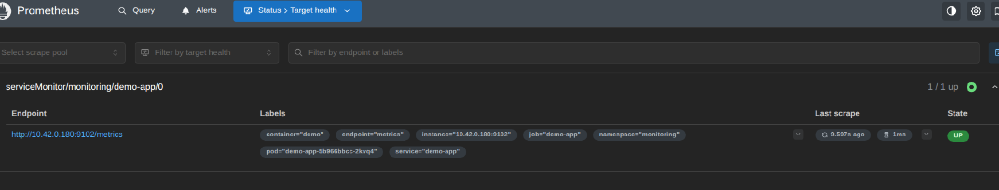

Absolutely — here are **clean, minimal, reliable snippets** you can use to *demonstrate the Prometheus Operator working* to your lecturer.  
Each snippet shows a **CRD → Operator → Reconciliation → Result** flow, which is exactly what the Operator Pattern is about.

I’ll give you three progressively stronger demos:

1. **ServiceMonitor** (the classic “hello world” of Prometheus Operator)  
2. **PrometheusRule** (Operator validates & loads alerting rules)  
3. **Prometheus CR scaling** (Operator reconciles StatefulSet changes)

These work even on small clusters.

---

# ⭐ Demo 1 — Create a ServiceMonitor (Operator discovers & scrapes your app)

This is the simplest and most convincing demonstration.

### **Step 1 — Deploy a tiny app that exposes metrics**
```yaml
apiVersion: apps/v1
kind: Deployment
metadata:
  name: demo-app
  namespace: monitoring
spec:
  replicas: 1
  selector:
    matchLabels:
      app: demo-app
  template:
    metadata:
      labels:
        app: demo-app
    spec:
      containers:
      - name: demo
        image: prom/statsd-exporter
        ports:
        - name: metrics
          containerPort: 9102
---
apiVersion: v1
kind: Service
metadata:
  name: demo-app
  namespace: monitoring
  labels:
    app: demo-app
spec:
  selector:
    app: demo-app
  ports:
  - name: metrics
    port: 9102
    targetPort: metrics
```

### **Step 2 — Create a ServiceMonitor**
```yaml
apiVersion: monitoring.coreos.com/v1
kind: ServiceMonitor
metadata:
  name: demo-app
  namespace: monitoring
spec:
  selector:
    matchLabels:
      app: demo-app
  endpoints:
  - port: metrics
    interval: 15s
```

### **Step 3 — Show the Operator reacting**
Run:

```bash
kubectl get servicemonitors -n monitoring
kubectl get servicemonitors --all-namespaces
```

Then show that Prometheus has picked it up:

```bash
kubectl port-forward -n monitoring svc/prometheus-k8s 9090
```

Open:

```
http://localhost:9090/targets
```

When i visit it I see:

